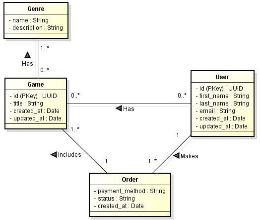

# Database Queries

This challenge is about the three forms of performing queries in a database:

- Through an ORM (Object Relational Mapper):

```js
this.repository.findOne({
  where: {
    id: user_id,
  },
  relations: ["games"],
});
```

- Query Builder:

```js
this.repository
      .createQueryBuilder("game")
      .innerJoinAndSelect("game.users", "user")
      .where("game.id = :id", { id })
      .getOne())
```

- Raw Query:

```js
this.repository.query(
  "SELECT * FROM users WHERE first_name ILIKE $1 AND last_name ILIKE $2",
  [first_name, last_name]
);
```

## Database Model


